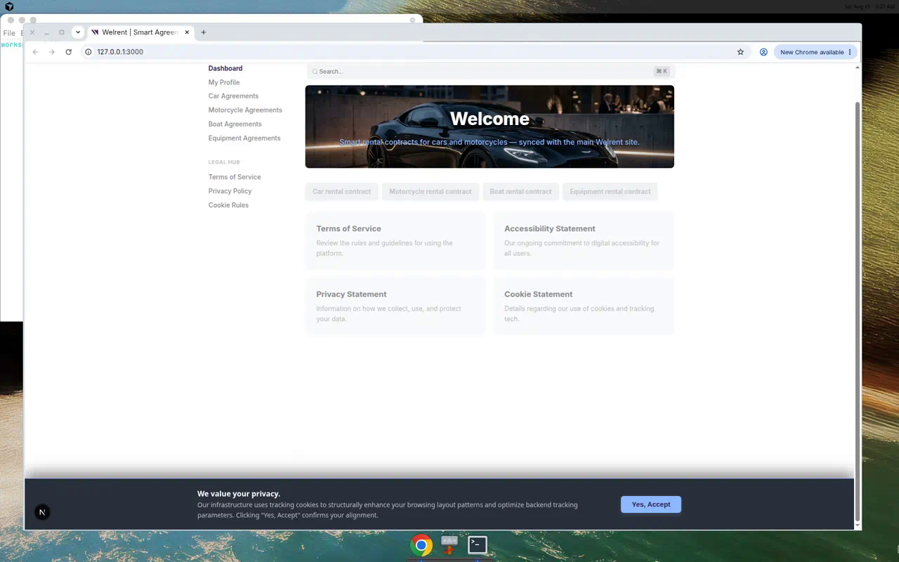
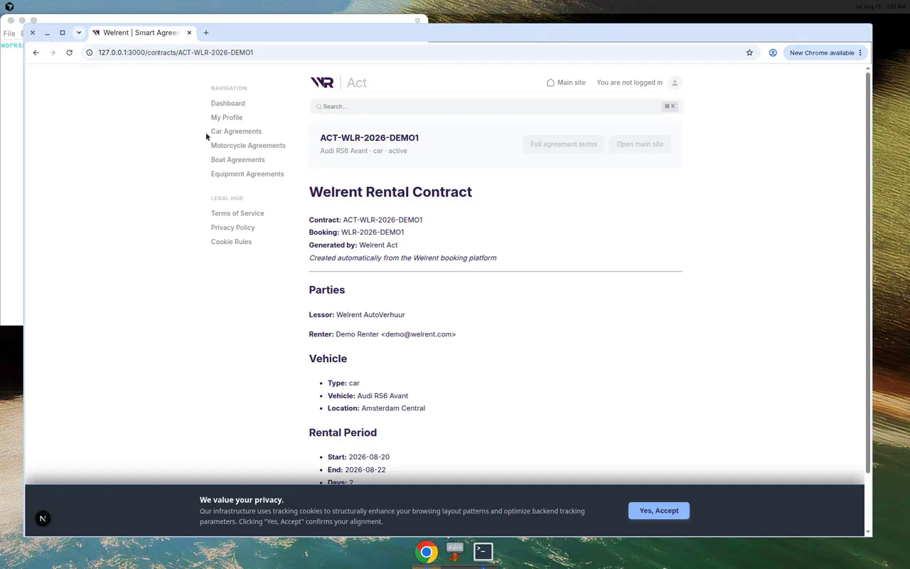
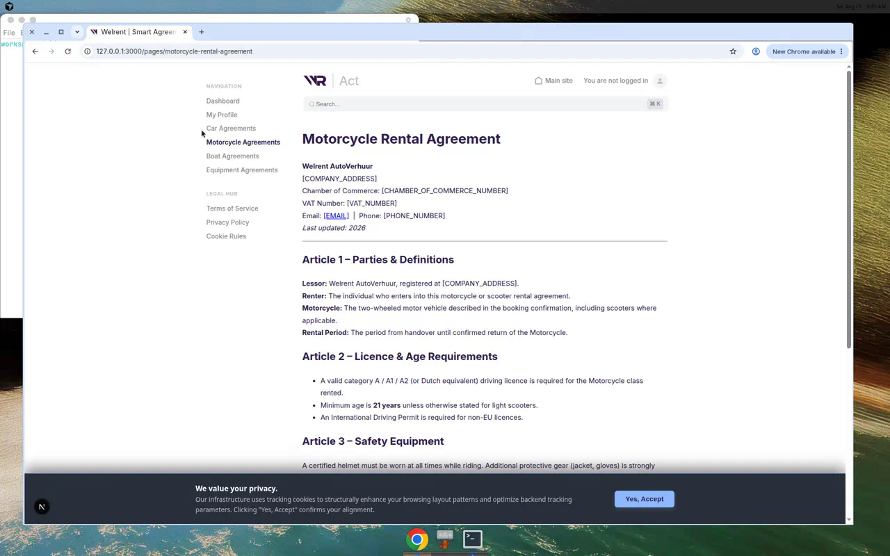
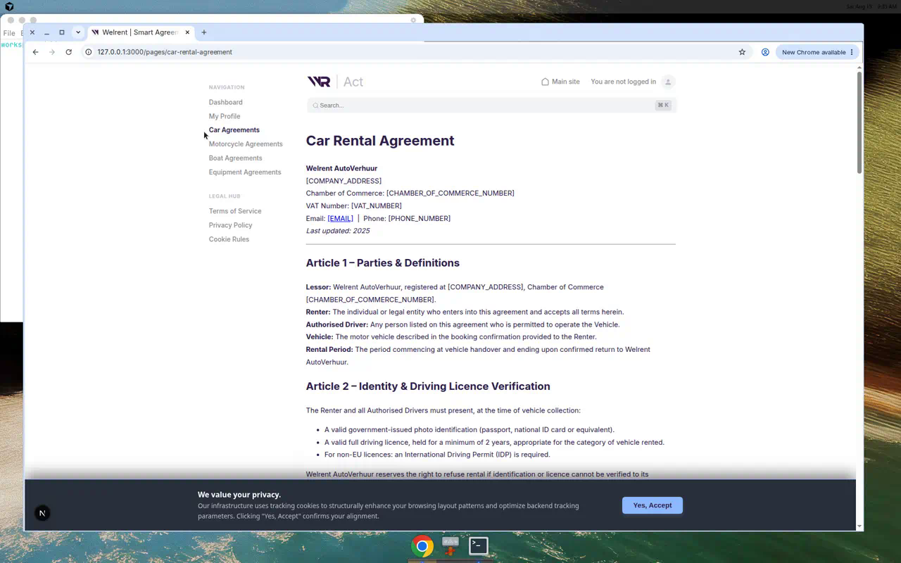
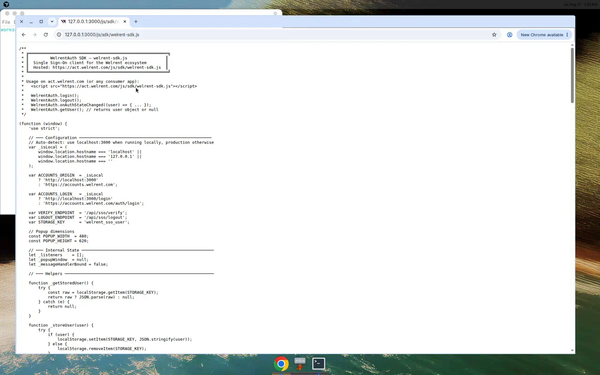

# Welrent Act

Smart rental **contracts** for the Welrent car & motorcycle platform.

Act automatically creates a rental contract when a booking is placed on the main site
([wr-frontend](https://github.com/welrent/wr-frontend)) and stores it so renters can open it from Act.

| Resource | URL |
|----------|-----|
| GitHub (public) | https://github.com/welrent/Act |
| Main rental site | https://github.com/welrent/wr-frontend |
| Production Act | https://act.welrent.com |
| Browser SDK | `/js/sdk/welrent-sdk.js` |

## Demo











**Demo video:** [docs/demo/welrent-act-demo.mp4](docs/demo/welrent-act-demo.mp4)

## How it works with wr-frontend

```text
wr-frontend booking (car / motorcycle)
        │
        ▼
 POST /api/rentals  (main site)
        │
        ├── saves rental row
        └── POST https://act.welrent.com/api/contracts
                    │
                    ▼
              Welrent Act contract
              /contracts/ACT-WLR-…
```

Integration drop-ins live in [`integrations/wr-frontend/`](integrations/wr-frontend/README.md).

### Create a contract (API)

```bash
curl -X POST http://localhost:3000/api/contracts \
  -H 'Content-Type: application/json' \
  -d '{
    "uid": "firebase-uid",
    "vehicle_type": "motorcycle",
    "car_name": "Yamaha MT-07",
    "start_date": "2026-09-01",
    "end_date": "2026-09-03",
    "days": 2,
    "price": 160,
    "booking_ref": "WLR-2026-ABCDE",
    "location": "Rotterdam Centrum"
  }'
```

### Browser SDK

```html
<script src="https://act.welrent.com/js/sdk/welrent-sdk.js"></script>
<script>
  // SSO
  WelrentAuth.login();
  WelrentAuth.onAuthStateChanged((user) => console.log(user));

  // Auto-create contract from a booking payload
  WelrentContracts.create({
    uid: 'firebase-uid',
    vehicle_type: 'car',
    vehicle_name: 'Audi RS6 Avant',
    start_date: '2026-08-20',
    end_date: '2026-08-22',
    days: 2,
    price: 380,
    booking_ref: 'WLR-2026-DEMO1'
  }).then(console.log);
</script>
```

## Apps in this repo

| Path | Description |
|------|-------------|
| `next-app/` | Next.js 16 Act web app (contracts UI + API) |
| `js/sdk/` | WelrentAuth + WelrentContracts browser SDK |
| `integrations/wr-frontend/` | Patches/helpers to wire the main site |
| `src/` + `Controllers/` | Legacy PHP Act shell (compat) |
| `secret-panel/` | Milkadmin control panel |

## Local development

```bash
cd next-app
npm install
npm run dev
# → http://127.0.0.1:3000
```

Without Turso credentials the app uses a local SQLite file at `next-app/.data/welrent-act.db`.

```bash
# Seed demo contracts + agreement pages
npm run seed:demo
npm run seed:agreements

# Smoke tests
node ../scripts/test-sdk.mjs
node ../scripts/test-api.mjs http://127.0.0.1:3000
```

Copy `next-app/.env.example` → `next-app/.env.local` for Firebase + Turso production values.

## Public repository status

- **Act:** public — https://github.com/welrent/Act  
- **wr-frontend:** public — https://github.com/welrent/wr-frontend  

## License

Proprietary — Welrent Europa B.V.
